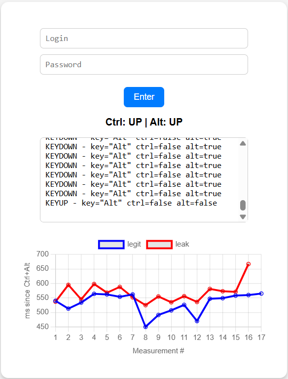
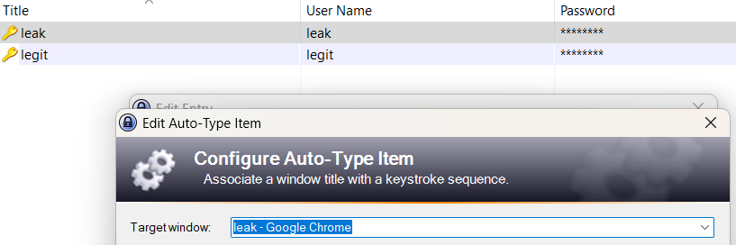
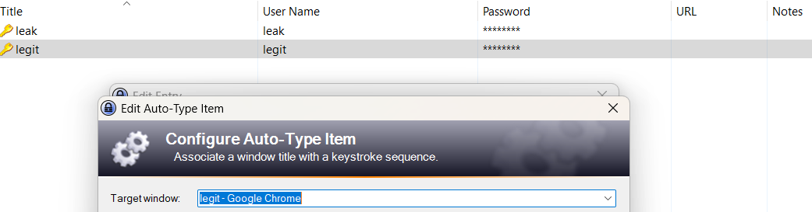

# KeePass Auto-Type Window Title Spoofing PoC

## Description (Primary one-liner)

**User interface (UI) misrepresentation / spoofing in the Auto-Type window/sequence matching component of KeePass Password Safe allows remote attackers controlling a web page to capture credentials for unrelated sites by dynamically setting the page’s window title to match a targeted entry, causing KeePass to auto-type the victim’s credentials into the attacker-controlled page when the user triggers Global Auto-Type.**

---

### Optional supporting details

*Conditions —* Auto-Type is enabled and associated by window title; the victim visits a malicious or compromised page and invokes Global Auto-Type.

*Impact —* Disclosure of credentials to an attacker-controlled origin, potentially leading to account takeover on the targeted service.

*Notes —* KeePass documents window-title matching as a compatibility-driven design; stronger origin binding requires plugins or exact per-window associations. 
Source: <https://keepass.info/help/base/autotype.html>
Doing so, KeePass does not fall under other "in browser" classes of vulnerabilities such as clickjacking <https://marektoth.com/blog/dom-based-extension-clickjacking/>

---

## Proof-of-Concept (`kp.html`)

The included `kp.html` demonstrates the attack in a single, static file:

1. The page listens for **Ctrl + Alt** key presses, KeePass’ default modifier combination before Global Auto-Type (`Ctrl + Alt + A`).  
2. On every press it sets `document.title = 'leak'` for one second.  
3. If the user now triggers Global Auto-Type while the fake title is active, KeePass matches the “leak” entry and types the corresponding credentials into the attacker-controlled page.  
4. The script measures the latency between the title spoof and the first keystroke, records it in memory, and renders a Chart.js graph for *legit* vs *leak* timings.

Timing distribution after several attempts reveal that when typing is slower, attack has increased chances to succeed.

Anyway since landing page is controlled, attacker may as well store user statistic habits in terms of typing using persistent statistics in indexDB to verify autotype is used by checking regular quick typing between inputs and mean time between DOMContentLoaded and character first input. After a sufficient number observations/measures, window name change could be triggered just on a time basis, independantly from user autotype shortcut with a controlled chance of success (depending on mean and variance of observations)... 

### Reproduction steps

1. Import / create a KeePass entry whose **Window title** matches `leak - *`.  
2. Import / create a KeePass entry whose **Window title** matches `legit - *`.  
  
  
1. Verify Global Auto-Type is enabled and configured with `Ctrl + Alt + A` (by default).  
2. Open `kp.html` in any modern browser locally or using online demo https://guilhem-.github.io/kp/kp.html:  
3. Focus the password field, press the Global Auto-Type shortcut, and observe your credentials appear in the attacker’s form and the timing chart update.

---

## References

* KeePass – Auto-Type documentation  
  <https://keepass.info/help/base/autotype.html>  
* KeePass – Security Issues: “Auto-Type Window/Sequence Matching” section  
  <https://keepass.info/help/kb/sec_issues.html#atmatch>

---

